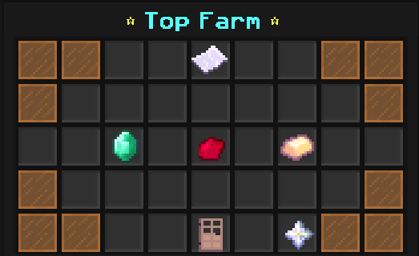
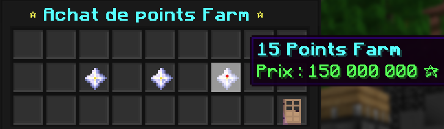

# Farm-Ranking 📈

[](https://www.spigotmc.org/)

A minecraft plugin of ranking. You can configure all the ranking menu, with the top factions.
You can also configure the Buy-Points menu, the price and the number of points to buy.


## Screenshots 🔍





## How to use it ✨

The main branch is the plugin working with FactionUUID plugin.
The saber-faction branch is for the Saber faction plugin.

Clone the project, or download the zip file and put the .jar into your plugins.

Then in game, write /farm to open the ranking menu, or /farmpoint to see how to set / add points to a faction
```bash
  /farmpoint
```


(You must have 3 factions created in the config.json file to open the /farm menu)
